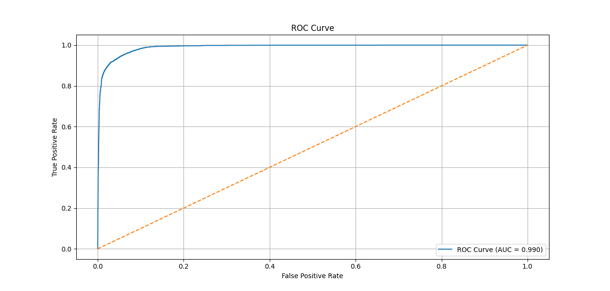

# Rain-Prediction-Model  

A machine learning project that predicts **rainfall occurrence (rain / no rain)** using atmospheric and environmental parameters such as temperature, humidity, wind speed, pressure, UV index, cloud cover, and more.  
This repository contains a complete pipeline from preprocessing, model training, evaluation, to metric visualization.


## Features  
- Full preprocessing workflow with a JSON-based numerization dictionary  
- Scalable TensorFlow model architecture  
- Binary classification (Rain vs No Rain)  
- Performance evaluation:
  - Confusion Matrix  
  - Precision, Recall, F1-Score  
  - ROC Curve + AUC  
- Modular Python scripts (`TrainModel.py`, `EvaluateModel.py`)  
- Clean and reproducible experiment setup  


## Dataset  

The dataset used in this project was obtained from Kaggle.  
It contains weather observations with the following relevant features:

- Temperature  
- Humidity  
- Wind Speed  
- Precipitation  
- Cloud Cover  
- Pressure  
- UV Index  
- Season  
- Visibility  
- Location  
- Rain (label: 0 = No Rain, 1 = Rain)

Missing categorical entries are handled through dictionary-based mapping stored in `numerization_dict.json`.


## Training the Model

Run the training script:

```bash
python TrainModel.py
```

This will:

* Load and preprocess the dataset
* Scale numerical features
* Train a binary classifier
* Save the trained model
* Print final loss and accuracy

Example training output:

```
Model Loss: 0.1070
Model Accuracy: 0.9584
```


## Evaluation

Evaluate the model on the test set:

```bash
python EvaluateModel.py
```

This script generates:

* Confusion Matrix

```
[[9656  244]
 [ 329 2971]]
```

* Precision: **0.9241**
* Recall: **0.9003**
* F1-Score: **0.9120**
* ROC Curve + AUC (example: **0.990**)




## Model Architecture

The model uses a feed-forward neural network with:

* Dense layers
* mish and swish activations
* Binary crossentropy loss
* Adamax optimizer

Optimized for binary weather classification tasks.


## Numerization Dictionary

Categorical features (e.g., Cloud Cover, Season, Location) are converted into numeric form using a mapping loaded from `numerization_dict.json`.
This ensures consistent preprocessing and reproducible results.


## Results Summary

| Metric    | Value  |
| --------- | ------ |
| Accuracy  | 0.9584 |
| Precision | 0.9241 |
| Recall    | 0.9003 |
| F1-Score  | 0.9120 |
| AUC       | 0.990  |

The model demonstrates high performance and strong discriminatory power.


## Future Improvements

Potential enhancements:

* Add more meteorological features (dew point, wind direction, solar radiation)
* Time-series forecasting using LSTM/GRU
* Deployment through a Flask or FastAPI service
* Interactive dashboard for predictions
* Automatic hyperparameter tuning (Keras Tuner, Optuna)


## License

This project is licensed under the MIT License.
